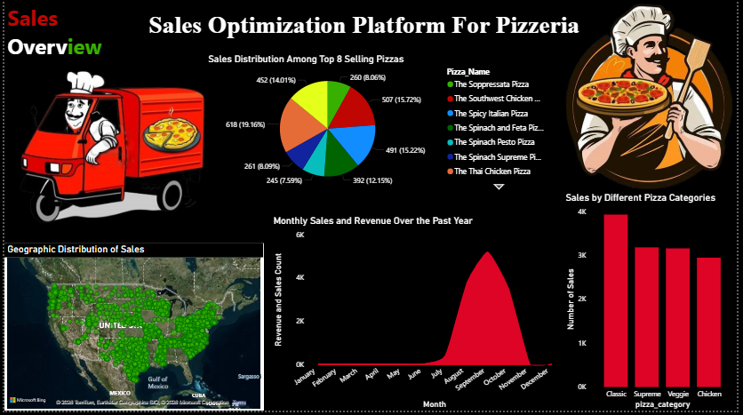
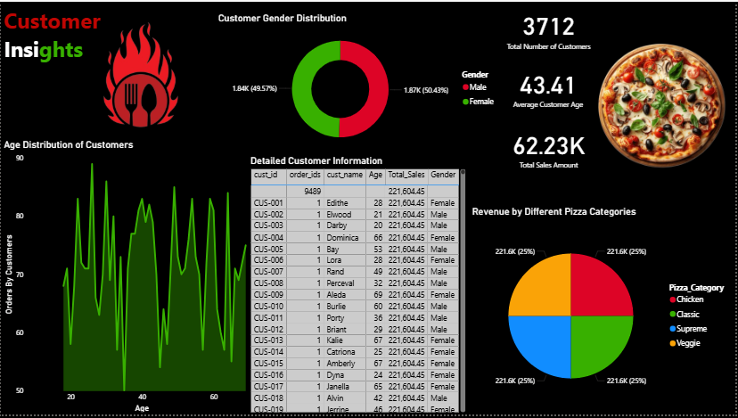
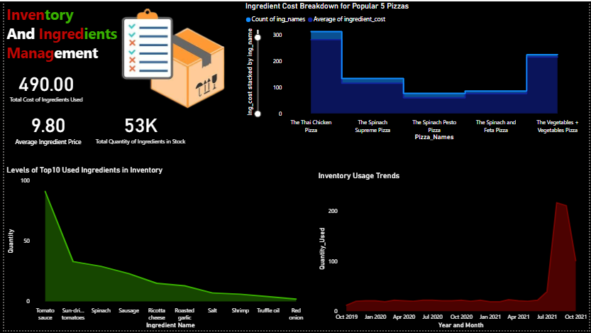
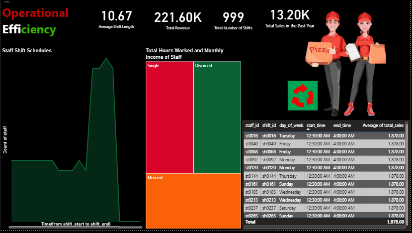

# 🍕 Pizzeria Sales Optimization Platform — Power BI Dashboard


A comprehensive Sales Optimization & Business Intelligence Dashboard built with Microsoft Power BI + MySQL.
This project demonstrates an end-to-end data analytics workflow — from database design and SQL querying to data modeling and interactive dashboard development.

The platform helps pizzerias make data-driven decisions to improve revenue, optimize inventory, understand customers, and increase operational efficiency.

---

## ✨ Dashboard Showcase

This Power BI dashboard includes multiple interactive pages for Sales, Customer Insights, Inventory Management, and Operational Efficiency.

### Dashboard Screenshots

**Sales Overview Dashboard**


**Customer Insights**


**Inventory Management**


**Operational Efficiency**


---

## 🚀 Features

- Executive Sales Overview
  - Total Revenue, Orders, Customers, and Top-Selling Pizzas KPIs.
- Time-Based Sales Analysis
  - Monthly, Weekly, and Yearly sales trends.
- Customer Insights
  - Gender & age distribution, revenue by pizza category.
- Inventory & Ingredients Management
  - Ingredient usage, cost analysis, stock levels, and trends.
- Operational Efficiency
  - Staff shift analysis, working hours, and cost per shift.
- Interactive Filtering
  - Dynamic slicers for date, pizza category, city, and customer segments.
- Clean & User-Friendly UI
  - Professional layout with structured navigation and visuals.

---

## 🛠️ Tech Stack & Methodology

This project demonstrates a complete Business Intelligence pipeline.

### 📊 Data Modeling (Star Schema)

- Central fact table: Orders
- Dimension tables:
  - Customers
  - Items
  - Address
  - Ingredients
  - Staff
  - Shifts
  - Rota
- Relationships designed for correct filter flow & performance.

### 🔄 Data Transformation (Power Query / M)

- Connected to MySQL database.
- Cleaned & transformed data:
  - Data type corrections
  - Handling nulls
  - Merging & shaping tables

### 📐 Business Logic (DAX)

Key DAX measures include:

- Total Sales
- Total Orders
- Total Customers
- Top Selling Pizzas
- Monthly Revenue
- Ingredient Cost
- Staff Cost per Shift

### 🎨 Report Design & Visualization

- UX-focused layout
- Consistent color theme
- Clear KPI cards & charts
- Drill-down & slicers for exploration

---

## 🗄️ Database Design & SQL

The backend uses MySQL with:

- Fully normalized schema
- Tables for:
  - Orders, Customers, Items, Recipes, Ingredients, Inventory
  - Staff, Shifts, and Rota
- Includes:
  - DDL scripts (table creation)
  - DML scripts (insert/update/delete)
  - Analytical queries (joins, aggregations, KPIs)

SQL files are in the /sql folder:

- tables_creation.sql
- ddl_and_dml.sql
- insertion.sql
- queries.sql

---

## 💻 Running the Project Locally

### 1️⃣ Prerequisites

- Install Power BI Desktop:
  https://powerbi.microsoft.com/desktop/
- Install MySQL Server + Workbench

---

### 2️⃣ Clone the Repository

git clone https://github.com/mtahir-ds/pizzeria-sales-optimization-platform.git
cd pizzeria-sales-optimization-platform

---

### 3️⃣ Set Up the Database (MySQL)

**Note:** Replace `your_username` with your actual MySQL username (default is often `root`).

Run these scripts in order:

```bash
mysql -u your_username -p < sql/tables_creation.sql
mysql -u your_username -p < sql/insertion.sql
mysql -u your_username -p < sql/queries.sql
```

Example with username `root`:
```bash
mysql -u root -p < sql/tables_creation.sql
mysql -u root -p < sql/insertion.sql
mysql -u root -p < sql/queries.sql
```

You will be prompted to enter your MySQL password after each command.

---

### 4️⃣ Open Power BI Dashboard

# Open the Power BI file (Windows)
start dashboard/Dashboard.pbix

# If Power BI shows data source errors:
# Go to: Transform Data -> Data Source Settings
# Update your MySQL connection details.

---

## 👤 Author

Muhammad Tahir  
LinkedIn: https://www.linkedin.com/in/muhammad-tahir-data/
